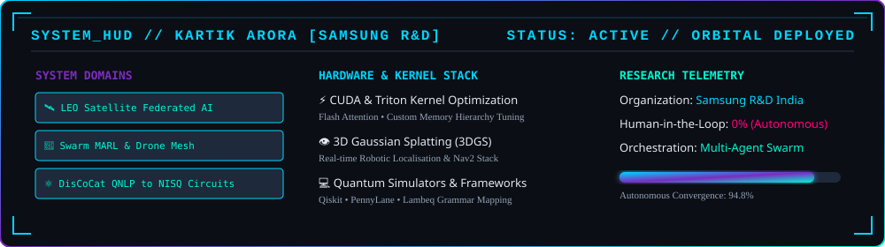
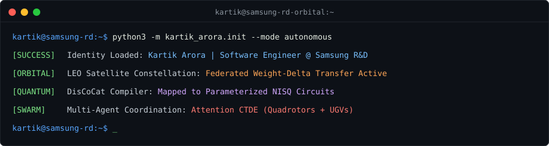
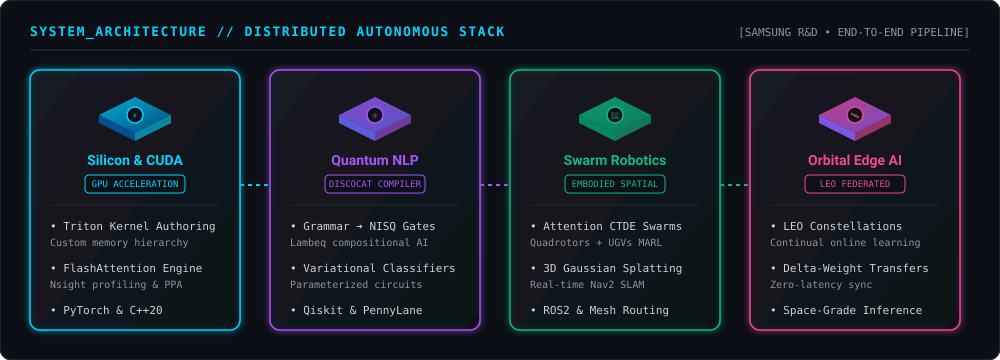
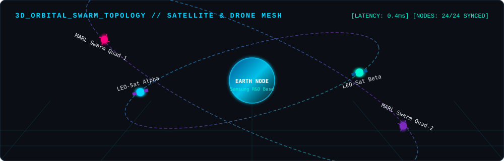
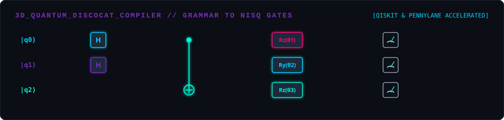
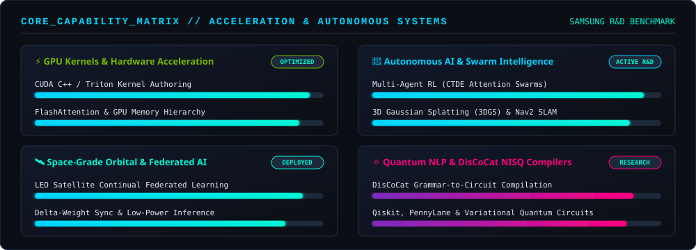
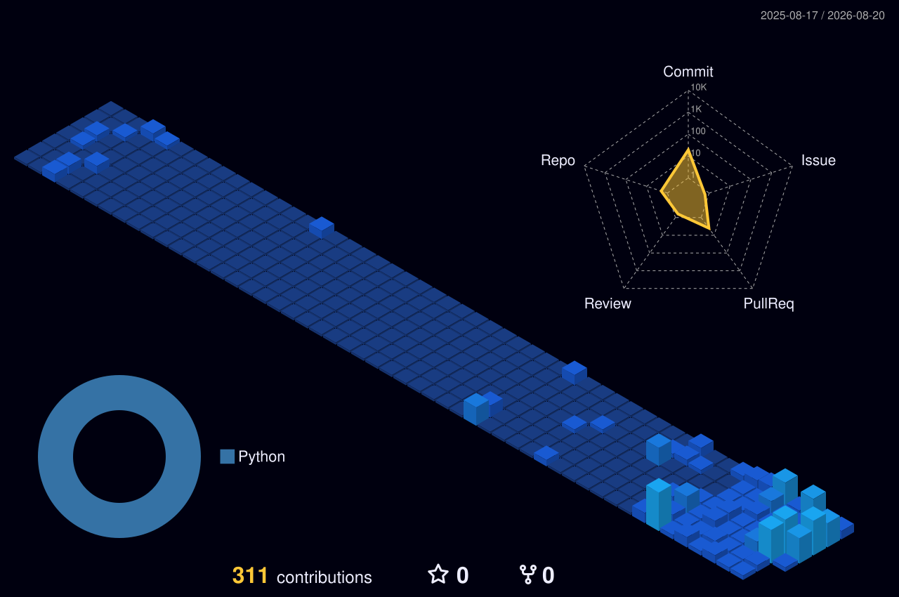
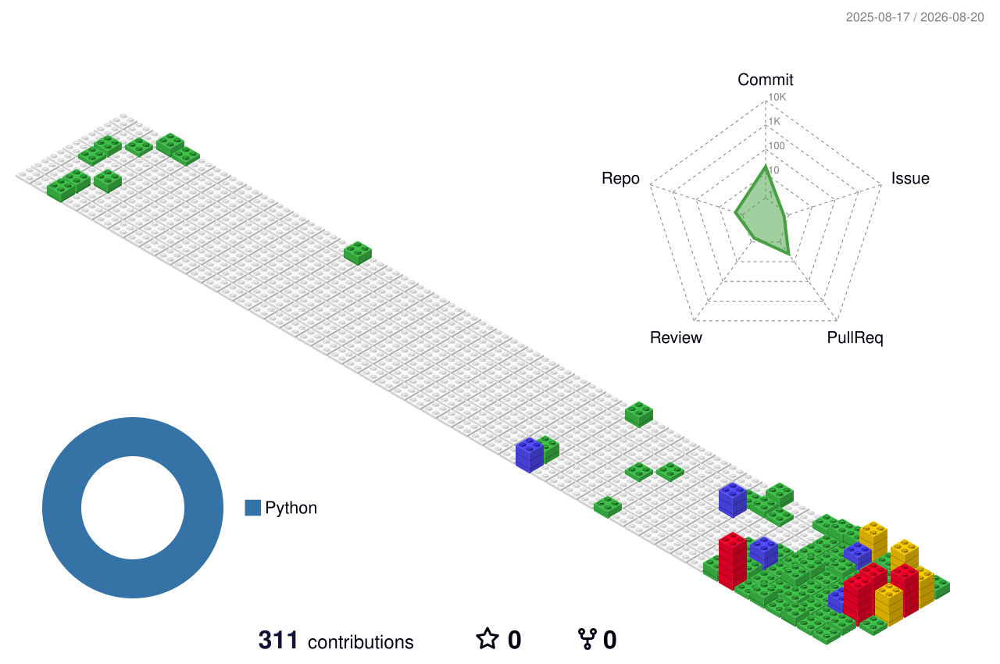
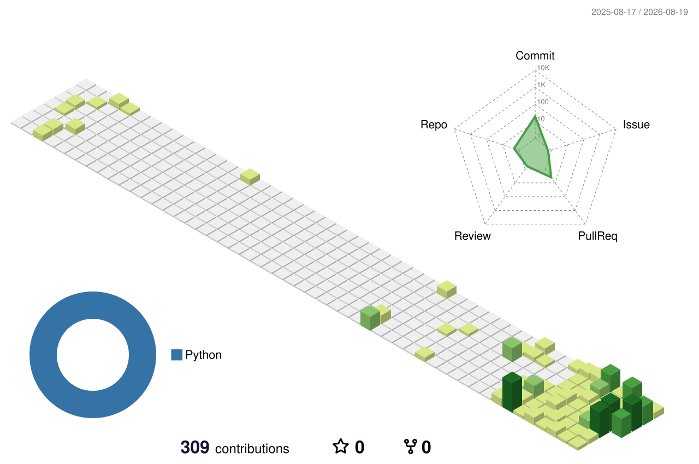

# KΛRTIK ΛRORΛ

<div align="center">
  
</div>

<div align="center">
  
</div>

<div align="center">
  
  
  
</div>

<div align="center">
  
  [](https://kartik-portfolio.site/)
  [](https://www.linkedin.com/in/kartik-arora-5319062a7/)
  [](https://medium.com/@arorakartik1589)
  [](mailto:kartik.arora.dev@gmail.com)
  
</div>

<br/>

<!-- ═══════ CUSTOM SVG: SYSTEM HUD DASHBOARD ═══════ -->
<div align="center">
  
</div>


## SYSTEM.INIT()

<!-- ═══════ CUSTOM SVG: MATRIX TERMINAL INTERFACE ═══════ -->
<div align="center">
  
</div>

<br/>

<details>
<summary><b>View Full System Architecture Code (Click to expand)</b></summary>

```python
class QuantumSwarmArchitect:
    def __init__(self):
        self.identity = {
            "name": "Kartik Arora",
            "organization": "Samsung R&D",
            "designation": "Software Engineer & AI Systems Researcher",
            "primary_mission": "Building intelligence that operates without human oversight",
            "research_domains": [
                "Autonomous AI Systems",
                "Swarm Intelligence & MARL",
                "Space-Grade Edge AI",
                "Embodied Robotics & Spatial Computing",
                "Quantum Computing & DisCoCat QNLP",
                "CUDA & Triton Kernel Engineering"
            ]
        }
        
        self.hardware_stack = {
            "accelerators": ["NVIDIA GPUs", "Triton Kernels", "Flash Attention"],
            "robotics": ["3D Gaussian Splatting (3DGS)", "Nav2 Stack", "ROS2"],
            "space_ai": ["LEO Constellation Simulation", "Federated Delta-Weight Sync"],
            "quantum": ["Qiskit", "PennyLane", "Lambeq DisCoCat Mapping"]
        }
        
    def execute_daily_routine(self):
        return [
            "Optimize custom GPU memory hierarchies with Triton & CUDA",
            "Train multi-agent reinforcement learning (MARL) quadrotor swarms",
            "Simulate space-grade federated continual learning across satellite nodes",
            "Compile grammatical sentence structures to parameterized NISQ circuits"
        ]

    def core_philosophy(self):
        return "Decentralizing intelligence across terrestrial, orbital, and quantum nodes."
```

</details>


## 🏗️ 3D ISOMETRIC FULL-STACK SYSTEM ARCHITECTURE

<div align="center">
  
</div>


## 📡 REAL-TIME TELEMETRY // ORBITAL RADAR &amp; QUANTUM STATE

<div align="center">
  
</div>


## 🛸 3D ORBITAL &amp; SWARM TOPOLOGY

<div align="center">
  
</div>


## ⚛️ 3D QUANTUM DISCOCAT COMPILER TOPOLOGY

<div align="center">
  
</div>


## 💎 CORE CAPABILITY &amp; HARDWARE ACCELERATION MATRIX

<div align="center">
  
</div>


## 🌐 3D SYSTEM CONTRIBUTION MATRIX

<div align="center">
  
</div>

<div align="center">
  
</div>

<details>
<summary><b>🔄 Toggle Alternative 3D Contribution Views (GitBlock &amp; Seasonal)</b></summary>

<br/>

<div align="center">
  <h4>3D GitBlock View</h4>
  
</div>

<div align="center">
  <h4>3D Animated Green View</h4>
  
</div>

</details>


## 🔬 RESEARCH MATRIX &amp; DOMAINS

<table align="center">
<tr>
<td width="50%">

### 🛰️ SPACE-GRADE EDGE AI
**`LEO Constellation Federated Learning`**
```yaml
Domain: Orbital Intelligence & Edge Computing
Mechanism:
  - Federated continual learning on LEO satellites
  - Distribution shift adaptation via inter-satellite deltas
  - Zero ground-station latency dependence
  - Space-rated low-power model compression
Repository Status: 🔒 Private R&D Repo
```

### 🤖 SWARM INTELLIGENCE & MARL
**`Multi-Agent Drone Coordination`**
```yaml
Domain: Autonomous Multi-Agent Systems
Mechanism:
  - Communication-constrained MARL (Quadrotors + UGVs)
  - Attention-based CTDE architecture under partial observability
  - Dynamic mesh routing & coordinate protocols
Repository Status: 🔒 Private Research Repo
```

</td>
<td width="50%">

### ⚛️ QUANTUM NLP & COMPUTING
**`DisCoCat to NISQ Circuits`**
```yaml
Domain: Compositional Quantum Intelligence
Mechanism:
  - Lambeq grammar-to-circuit mapping
  - Variational sentence classification on NISQ hardware
  - Qiskit & PennyLane simulator benchmarking
Repository Status: 🔒 Private Research Repo
```

### ⚡ GPU KERNEL OPTIMIZATION
**`CUDA & Triton High Performance`**
```yaml
Domain: Hardware Acceleration & AI Systems
Mechanism:
  - Custom Triton kernel authoring & Flash Attention
  - Memory profiling & Nsight hierarchy tuning
  - Real-time 3D Gaussian Splatting (3DGS) for robotics
Repository Status: 🔒 Private R&D Repo
```

</td>
</tr>
</table>


## 📝 PUBLISHED ARTICLES &amp; FEATURED RESEARCH

<!-- BLOG-POST-LIST:START -->
| Publication / Research Area | Focus & Mechanism | Access / Link |
| :--- | :--- | :---: |
| **Transformer Architecture Deep Dive** | Comprehensive breakdown of self-attention mechanisms, FlashAttention, and LLM scaling laws. | [📖 Read Article on Medium](https://medium.com/@arorakartik1589/transformer-architecture-deep-dive-b5514af147aa) |
| **DisCoCat QNLP Compiler** | Compiling natural language grammar structures directly into NISQ quantum circuits using Lambeq. | 🔒 Private Research Repository |
| **Orbital Federated Satellite AI** | Simulated federated continual learning on low Earth orbit constellations via delta-weights. | 🔒 Private Research Repository |
| **3DGS Real-Time Robotic SLAM** | 3D Gaussian Splatting representation for real-time localization in Nav2-stack robotics. | 🔒 Private R&D Repository |
<!-- BLOG-POST-LIST:END -->


## 🎯 ENGINEERING &amp; RESEARCH ACCOMPLISHMENTS

<div align="center">
  <table>
    <tr>
      <td align="center" width="33%">
        
        <br/>
        <sub><b>Software Engineer</b></sub>
        <br/>
        <sub>AI Systems Research</sub>
        <br/>
        <sub>Embedded &amp; Edge Acceleration</sub>
      </td>
      <td align="center" width="33%">
        
        <br/>
        <sub><b>DisCoCat QNLP</b></sub>
        <br/>
        <sub>NISQ Circuit Compilers</sub>
        <br/>
        <sub>Variational Classifiers</sub>
      </td>
      <td align="center" width="33%">
        
        <br/>
        <sub><b>3DGS &amp; MARL</b></sub>
        <br/>
        <sub>Nav2 Robot Localisation</sub>
        <br/>
        <sub>Multi-Agent Drone Swarms</sub>
      </td>
    </tr>
  </table>
</div>


## 🛠️ NEURAL TECHNOLOGY STACK

<p align="center">
  
  
  
  
  
  
  
  
</p>


## 🌈 SYSTEM ACTIVITY SPECTRUM

<div align="center">
  
</div>

<div align="center">
  
</div>


## 📊 SYSTEM ANALYTICS

<div align="center">
  
  
</div>

<div align="center">
  
</div>

<br/>

<div align="center">
  <h3>⚡ Contribution Activity Grid ⚡</h3>
  <picture>
    <source media="(prefers-color-scheme: dark)" srcset="https://raw.githubusercontent.com/techieguy-kartik/techieguy-kartik/output/github-snake-dark.svg">
    <source media="(prefers-color-scheme: light)" srcset="https://raw.githubusercontent.com/techieguy-kartik/techieguy-kartik/output/github-snake.svg">
    
  </picture>
</div>


<div align="center">
  
</div>

<br/>

<div align="center">
  
</div>

<div align="center">
  <sub>Designed with Cyberpunk HUD Architecture &amp; Quantum Precision // Kartik Arora @ Samsung R&amp;D</sub>
</div>
